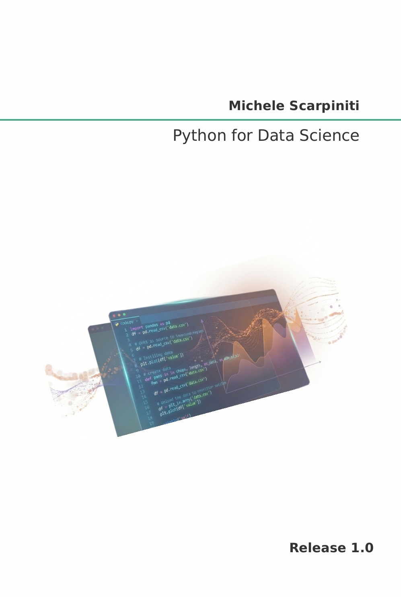

# Python for Data Science

This repository contains all the sorce code of [**Python for Data Science**](https://www.amazon.it/dp/B0H1BZBWZG) book, in the form of Jupyter notebooks.
The book, based on the author's teaching experience, aims to introduce the fundamental concepts of Python with applications in data science.




## Index
1. [Introduction](Notebooks/1_Introduction.ipynb)
2. [Python environment](Notebooks/2_Python_environment.ipynb)
3. [Python basics](Notebooks/3_Python_basics.ipynb)
4. [Python coding](Notebooks/4_Python_coding.ipynb)
5. [Main Python libraries](Notebooks/5_Main_Python_libraries.ipynb)
6. [Data manipulation](Notebooks/6_Data_manipulation.ipynb)
7. [Exploratory Data Analysis](Notebooks/7_Exploratory_Data_Analysis.ipynb)
8. [Data preparation](Notebooks/8_Data_preparation.ipynb)


## About
The book introduces the fundamental concepts of Python with applications in data science. It offers a compact, self-contained, and accessible collection of methodologies and practical examples designed to support learning. The text is intended for undergraduate and graduate students who may not have a prior programming experience. 


## Python requirements
The book was written and tested with Python 3.12, though other Python 3.x versions should work in nearly all cases.


If you have Git installed, you can clone the book repository, otherwise simply download it and move to the correct folder:
```
git clone https://github.com/mscarpiniti/PyDSBook.git
cd PyDSBook
```


To use the code, it is suggested to create a new Python 3.12 environment (i.e., `PyDS`) with Spyder and `pip`:
```
conda create -n PyDS python=3.12 Spyder pip
```

Then activate the environment and install all requirements:
```
conda activate PyDS
pip install -r requirements.txt
```

#### Want to play with these notebooks online without having to install anything?

Open this repository in [Colaboratory](https://colab.research.google.com/github/mscarpiniti/PyDSBook/blob/master/):
<a href="https://colab.research.google.com/github/mscarpiniti/PyDSBook/blob/master/"></a>


## License
The code in this repository, including all code samples in the notebooks listed above, is released under the [Apache License, Version 2.0](LICENSE). Read more at the [Open Source Initiative](https://opensource.org/license/apache-2.0).
